<h1 align="center"> rn-task-app </h1>

<p align="center">
  <a href="https://github.com/ErickLuizA/rn-task-app/graphs/commit-activity" alt="Maintenance">
    
  </a>

  <a href="./LICENSE" alt="License: MIT">
    
  </a>

<br/>


<a href="https://github.com/ErickLuizA/rn-task-app/stargazers">
  
</a>

<p align="center">
  <a href="#clipboard-description">Description</a>&nbsp;&nbsp;&nbsp;|&nbsp;&nbsp;&nbsp;
  <a href="#building_construction-technologies">Technologies</a>&nbsp;&nbsp;&nbsp;|&nbsp;&nbsp;&nbsp;
  <a href="#rocket-getting-started">Getting Started</a>&nbsp;&nbsp;&nbsp;|&nbsp;&nbsp;&nbsp;
  <a href="#memo-license">License</a>&nbsp;&nbsp;&nbsp;|&nbsp;&nbsp;&nbsp;
  <a href="#framed_picture-screenshots">Screenshots</a>
</p>


## :clipboard: Description

rn-task-app is a task noting app built with React Native and Firebase

## :building_construction: Technologies

- [Firebase](https://firebase.google.com)

- [Typescript](https://www.typescriptlang.org/)

- [React Native](https://reactnative.dev/)
  - [Expo](https://expo.io)
  - [Redux](https://redux.js.org/)
  - [Redux-Saga](https://redux-saga.js.org/)
  - [Redux-Persist](https://github.com/rt2zz/redux-persist)
  - [React-Native-Circular-Progress](https://github.com/bartgryszko/react-native-circular-progress#usage)
  - [Async-Storage](https://react-native-async-storage.github.io/async-storage/docs/install/)
  - [React-Native-Paper](https://callstack.github.io/react-native-paper/getting-started.html)
  - [React-Nativigation](https://reactnavigation.org/docs/getting-started/)


## :rocket: Getting Started

## 1. Download the repository

```shell
 $ git clone https://github.com/ErickLuizA/rn-task-app.git
 
 or

 $ gh repo clone ErickLuizA/rn-task-app
```

## 2. Installation

```shell
# Go into the repository
$ cd rn-task-app

# Install dependencies
$ npm install
```

## 3. Execution

```shell
$ expo start
```

## 4. Firestore data structure 

```shell
Users Collection -
Doc with user id as id -
Tasks Collection -
Task docs 
```


## :framed_picture: Screenshots

<div>
  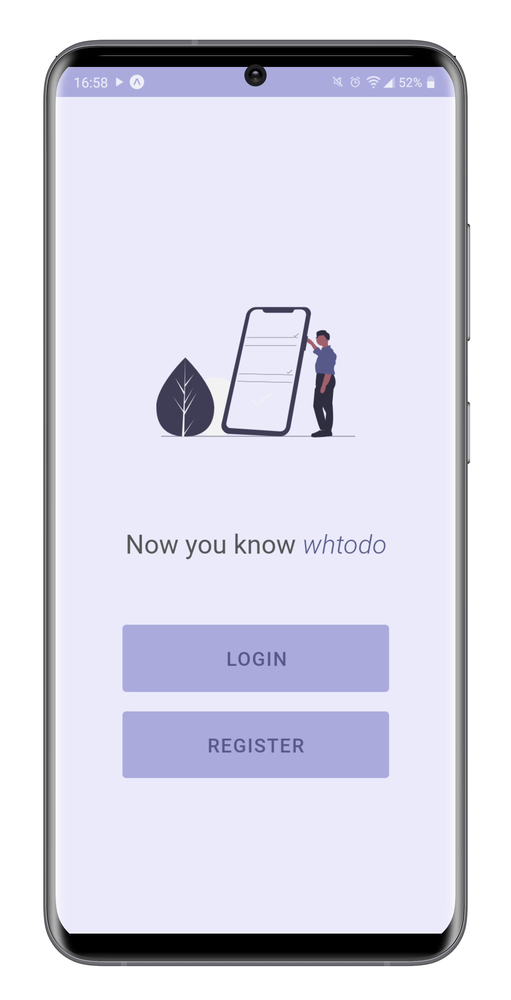
	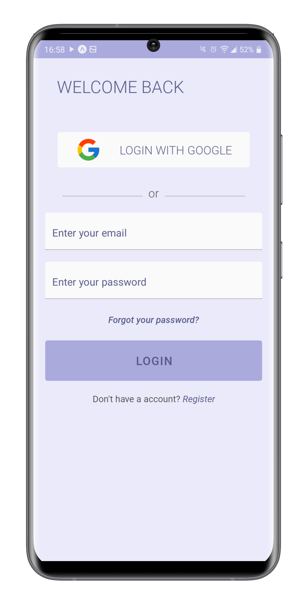
  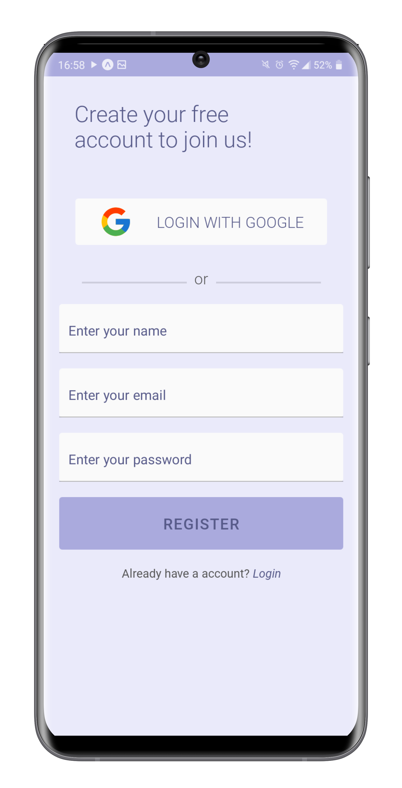
  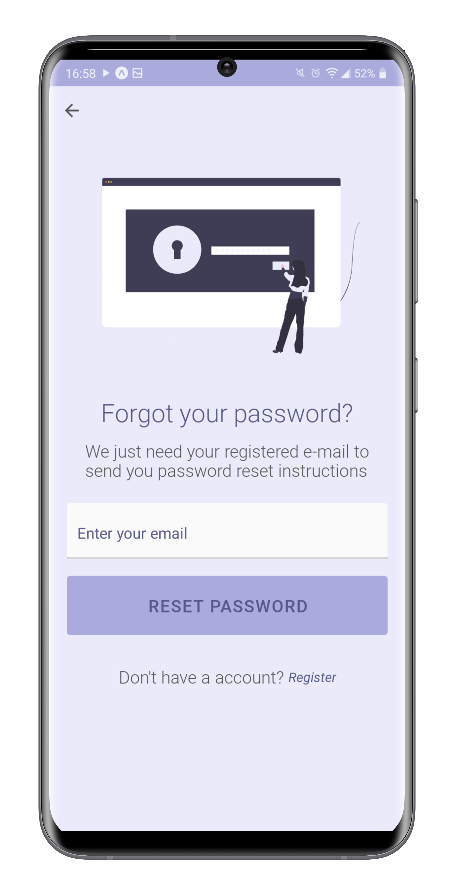
  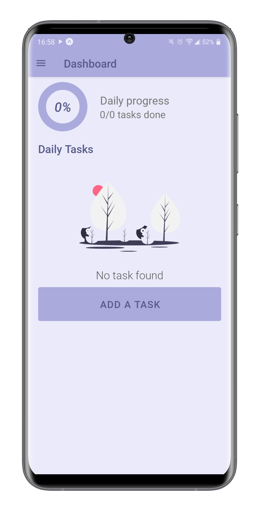
  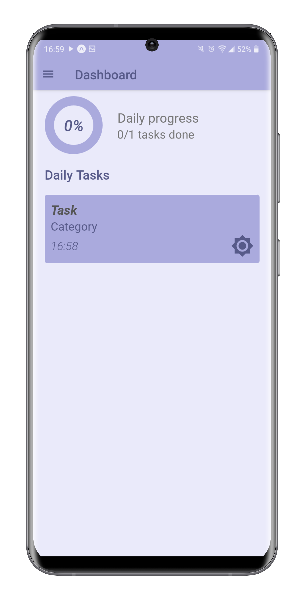
  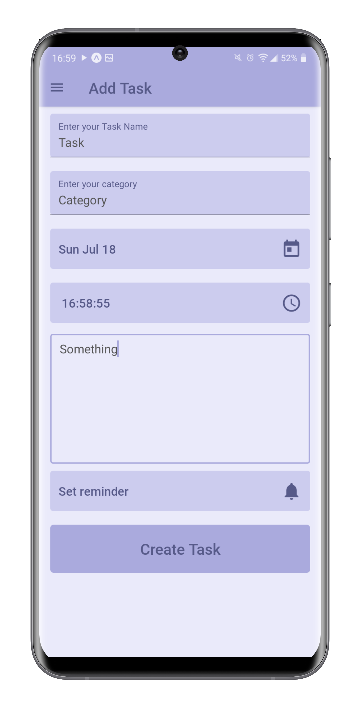
  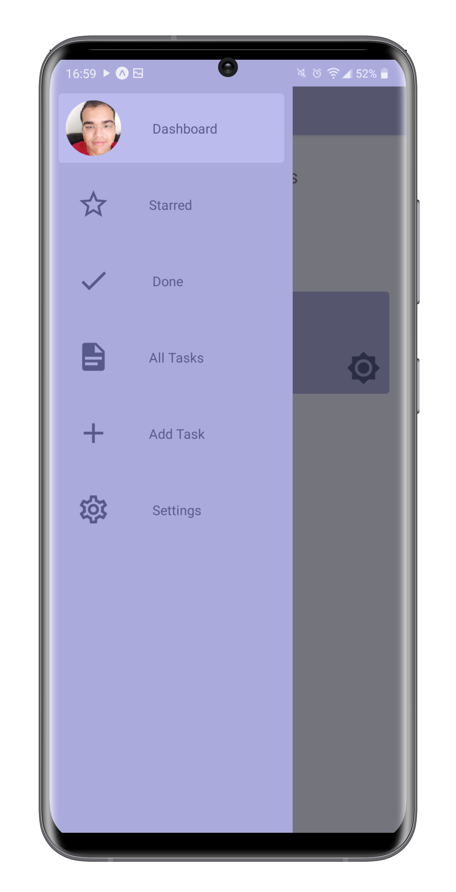
  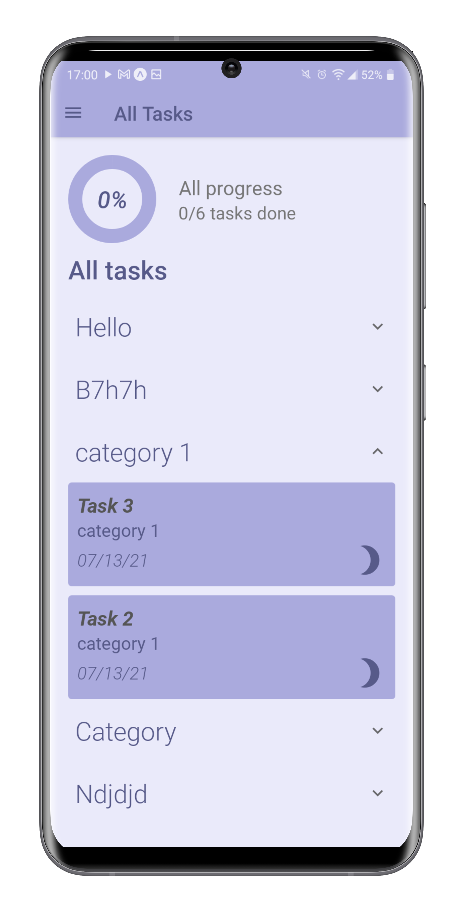
  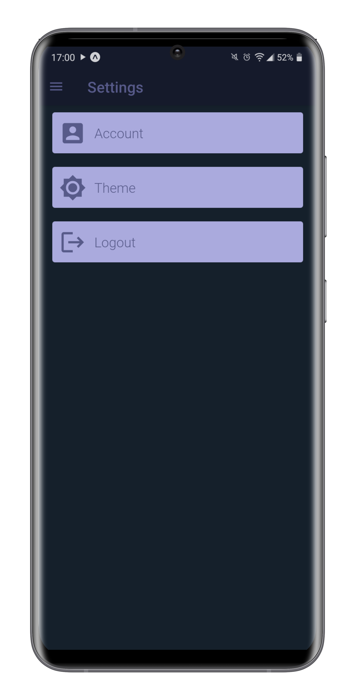
	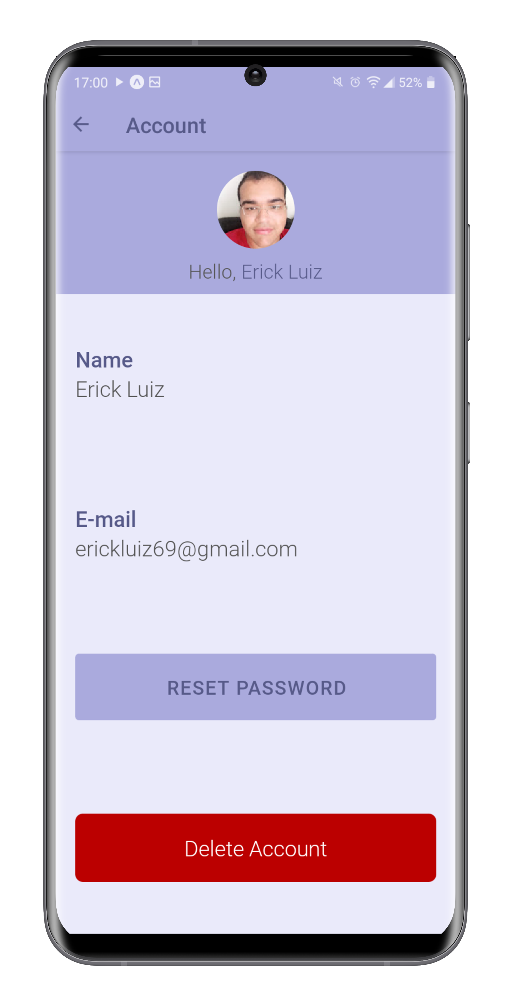  
</div>

## :information_source: TODO
  - Add notifications
  - Implement tests

## :memo: License

This project is under the MIT license. See the file [LICENSE](LICENSE) for more details.

---

Build with 💙 By [Erick](https://www.linkedin.com/in/erick-luiz-47151a1a4/)
